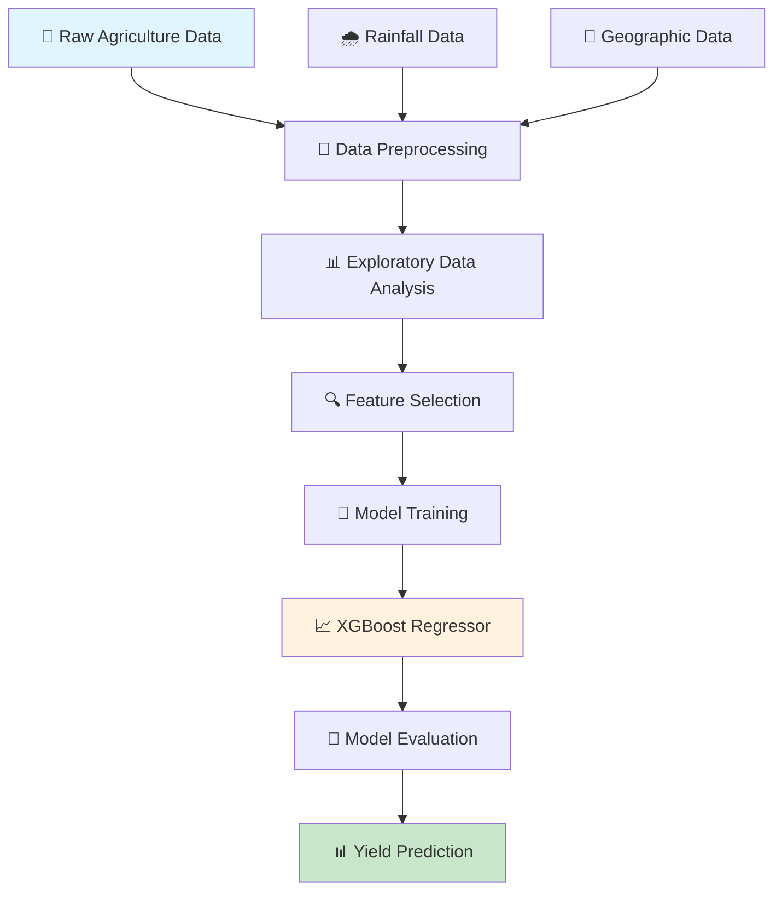

# 🌾 Agriculture Analytics & Wheat Yield Prediction 📊

[](https://python.org)
[](https://xgboost.readthedocs.io/)
[](LICENSE)
[](https://github.com/anand9752/Agriculture-Analyzing-and-wheat-yield-prediction)

## 🚀 Project Overview

This project combines **agricultural statistics** with **rainfall data** to analyze and predict wheat yields across various Indian states spanning over 52 years (1966-2017). Using machine learning techniques, we explore the relationship between monsoon rainfall patterns and agricultural productivity, specifically focusing on wheat crop yields.

## 🎯 Objectives

- 🔍 **Analyze** the impact of monsoon rainfall on wheat yields
- 📈 **Predict** wheat productivity based on environmental and agricultural factors
- 🗺️ **Identify** high-yielding and low-yielding states
- 🌧️ **Understand** seasonal rainfall correlation with crop output
- 📊 **Visualize** agricultural trends over time

## 📁 Dataset Overview

### 🌾 Rain-Agriculture Dataset Structure

| 📋 Category | 📊 Example Columns | 📝 Description |
|-------------|-------------------|----------------|
| 📍 **Location Info** | `State Name`, `subdivision`, `Dist Code`, `State Code` | Geographic identification of data records |
| 📅 **Temporal Info** | `Year`, `YEAR` | Year of observation (1966–2017) |
| 🌧️ **Rainfall Data** | `JUN`, `JUL`, `AUG`, `SEP` | Monthly average rainfall (mm) during monsoon season |
| 🌾 **Crop Area** | `RICE AREA (1000 ha)`, `WHEAT AREA`, ... | Total area cultivated for each crop (in 1000 hectares) |
| 📦 **Crop Production** | `RICE PRODUCTION (1000 tons)`, `MAIZE PRODUCTION`, ... | Total crop production in 1000 tons |
| 📈 **Crop Yield** | `RICE YIELD (Kg per ha)`, `COTTON YIELD`, ... | Yield per hectare (productivity) in kilograms |
| 🥗 **Horticulture** | `FRUITS AREA`, `VEGETABLES AREA` | Area cultivated for fruits and vegetables |

### 📊 Dataset Statistics
- **📈 Time Period**: 52 years (1966-2017)
- **🗺️ Geographic Coverage**: Multiple Indian states
- **🌾 Primary Focus**: Wheat yield prediction
- **📏 Data Points**: 938 records
- **🔢 Features**: 80+ agricultural and meteorological variables

## 🏗️ Project Architecture



## 🛠️ Technical Stack

### 📚 Libraries & Technologies

| 🏷️ Category | 🔧 Technology | 📝 Purpose |
|-------------|---------------|------------|
| **🐍 Core** | Python 3.7+ | Primary programming language |
| **📊 Data Analysis** | Pandas | Data manipulation and analysis |
| **🔢 Numerical Computing** | NumPy | Mathematical operations |
| **📈 Visualization** | Matplotlib, Seaborn | Data visualization and plotting |
| **🤖 Machine Learning** | XGBoost | Gradient boosting for regression |
| **⚙️ ML Utils** | Scikit-learn | Model evaluation and preprocessing |

### 🔧 Installation

```bash
# Clone the repository
git clone https://github.com/anand9752/Agriculture-Analyzing-and-wheat-yield-prediction.git

# Navigate to project directory
cd Agriculture-Analyzing-and-wheat-yield-prediction

# Install required packages
pip install pandas numpy matplotlib seaborn xgboost scikit-learn jupyter
```

## 🔄 Workflow Pipeline

### 1. 📥 Data Import & Setup
```python
import pandas as pd
import numpy as np
import matplotlib.pyplot as plt
import seaborn as sns
import xgboost as xgb
```

### 2. 🧹 Data Preprocessing
- ✅ Filter wheat-related data (Area > 0, Production > 0, Yield > 0)
- 🎯 Select relevant features: Wheat Area, Production, Yield + Rainfall data
- 🔍 Handle missing values (Dataset has no null values)
- 🏷️ Apply Label Encoding for categorical variables

### 3. 📊 Exploratory Data Analysis

#### 🔍 Key Findings:

- 🏆 **Top Wheat Producing States**: Punjab leads in wheat yield
- 📉 **Lowest Yielding States**: Tamil Nadu and Kerala
- 📈 **Yield Distribution**: Most states achieve around 1500 kg/ha
- 🌧️ **Rainfall Impact**: 
  - June rainfall: -0.35 correlation (moderate negative impact)
  - August rainfall: -0.19 correlation (minimal impact)

### 4. 🤖 Model Development

#### 🎯 Target Variable
- **Wheat Yield (Kg per ha)** - Primary prediction target

#### 🔧 Features Used
- 🌾 **Agricultural**: Wheat Area, Wheat Production
- 🌧️ **Meteorological**: Monsoon rainfall (JUN, JUL, AUG, SEP)
- 📅 **Temporal**: Year
- 📍 **Geographic**: State Name (Label Encoded)

#### 🚀 Model Selection: XGBoost Regressor

**Why XGBoost?**
- ✅ High accuracy and efficiency
- ✅ Handles numeric and categorical features well
- ✅ Automatic feature selection capability
- ✅ Robust against overfitting

```python
model = xgb.XGBRegressor(
    n_estimators=100,
    learning_rate=0.1,
    max_depth=4,
    random_state=42
)
```

## 📊 Model Performance

### 🎯 Evaluation Metrics
- **RMSE (Root Mean Squared Error)**: Measures average prediction error
- **R² Score**: Explains variance in yield explained by the model

### 🏆 Results
```
📊 Model Performance:
RMSE: [Value from model output]
R² Score: [Value from model output]
```

### 📈 Feature Importance
The model identifies the most influential factors affecting wheat yield through feature importance analysis.

## 📊 Data Visualizations

### 🔍 Analysis Insights

1. **📈 Temporal Trends**: Wheat yield changes over 52 years
2. **🗺️ State-wise Analysis**: Comparative yield performance across states
3. **🌧️ Rainfall Correlation**: Heatmap showing rainfall-yield relationships
4. **📊 Distribution Analysis**: Yield distribution patterns
5. **🔗 Feature Relationships**: Scatter plots for area vs yield, production vs yield

## 🚀 Getting Started

### 🏃‍♂️ Quick Start

1. **📂 Open the Jupyter Notebook**:
   ```bash
   jupyter notebook predicting-wheat-yield-using-rainfall-agricultu.ipynb
   ```

2. **▶️ Run the Analysis**:
   - Execute cells sequentially
   - Explore data visualizations
   - Train the machine learning model
   - Analyze predictions

3. **🔧 Customize Analysis**:
   - Modify parameters
   - Add new features
   - Try different models
   - Extend to other crops

## 📈 Use Cases

- 🌾 **Agricultural Planning**: Predict crop yields for resource allocation
- 🏛️ **Policy Making**: Support government agricultural policies
- 💼 **Insurance**: Agricultural insurance risk assessment
- 📊 **Research**: Climate change impact on agriculture
- 🎯 **Farm Management**: Optimize farming practices

## 🔮 Future Enhancements

- 🌡️ **Weather Integration**: Include temperature, humidity data
- 🛰️ **Satellite Data**: Add remote sensing information
- 🌍 **Multi-Crop Analysis**: Extend to other crops (rice, maize, etc.)
- 🤖 **Advanced ML**: Implement deep learning models
- 📱 **Web Interface**: Create user-friendly prediction interface
- 🌐 **Real-time Predictions**: Live weather data integration

## 📁 Project Structure

```
🌾 Agriculture-Analyzing-and-wheat-yield-prediction/
├── 📊 predicting-wheat-yield-using-rainfall-agricultu.ipynb  # Main analysis notebook
├── 📈 rain-agriculture.csv                                  # Dataset file
├── 📝 README.md                                            # Project documentation
└── 🔧 requirements.txt                                     # Dependencies (if added)
```

## 🤝 Contributing

Contributions are welcome! Please feel free to submit a Pull Request. For major changes, please open an issue first to discuss what you would like to change.

### 🛠️ How to Contribute

1. 🍴 Fork the repository
2. 🌿 Create a feature branch (`git checkout -b feature/AmazingFeature`)
3. 💾 Commit your changes (`git commit -m 'Add some AmazingFeature'`)
4. 📤 Push to the branch (`git push origin feature/AmazingFeature`)
5. 🔄 Open a Pull Request

## 📜 License

This project is licensed under the MIT License - see the [LICENSE](LICENSE) file for details.

## 👨‍💻 Author

**Anand** - [@anand9752](https://github.com/anand9752)

## 🙏 Acknowledgments

- 📊 **Kaggle**: For providing the India Rain-Agriculture dataset
- 🌾 **Agricultural Research**: For inspiration and domain knowledge
- 🤖 **Open Source Community**: For excellent ML libraries
- 🌧️ **Meteorological Departments**: For weather data collection

## 📞 Contact

- 📧 **Email**: [Your Email]
- 🐙 **GitHub**: [@anand9752](https://github.com/anand9752)
- 💼 **LinkedIn**: [Your LinkedIn Profile]

---

<div align="center">

### 🌾 "Predicting Agriculture, Nurturing the Future" 🌱

**Made with ❤️ for sustainable agriculture**

[](https://github.com/anand9752/Agriculture-Analyzing-and-wheat-yield-prediction)

</div>
